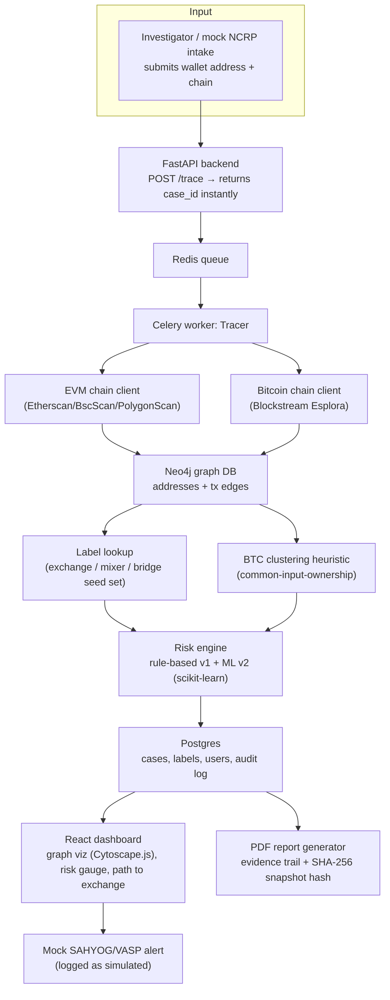
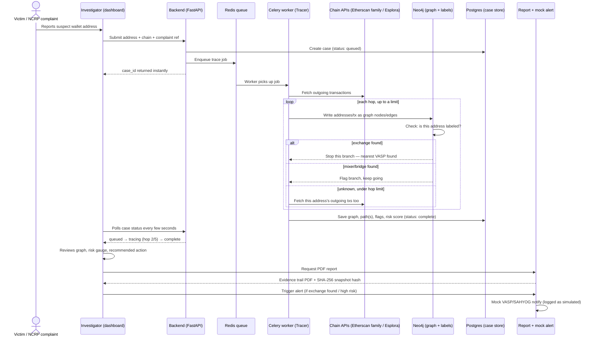

# Real-Time Crypto Fraud Attribution System — 2–3 Week Build Plan (v2)

**PS:** Real-Time Identification of Fraud-Linked Cryptocurrency Exchanges from Victim-Reported Suspect Wallet Addresses through Automated Blockchain Analytics
**Team:** web-dev comfortable, blockchain new · **Time:** 2–3 weeks · **Level:** beginner-friendly, learning-first

> This supersedes the earlier 4-day sprint version. If your timeline ever shrinks back down, the fallback is simple: drop Neo4j (use in-memory NetworkX instead), drop Bitcoin, drop the ML step, keep everything else — that's exactly the leaner version. Nothing here is wasted if that happens; it's a strict superset.

---

## 0. Answering the practical question first: do you need a crypto account?

**No. You never buy, hold, or touch real cryptocurrency anywhere in this project.** This surprises a lot of beginners, so here's why it's true and what you actually need instead.

**Why:** every public blockchain (Bitcoin, Ethereum, BSC, Polygon, Tron...) is, by design, a public ledger. Anyone, anywhere, can read the full transaction history of any address, forever, for free, without permission or an account. That's not a workaround — it's the entire premise blockchain forensics is built on. You are only ever *reading* public data, never sending funds or controlling a wallet.

**What you actually need (all free, none require money or KYC):**

| Need | What it is | Cost | Required? |
|---|---|---|---|
| Etherscan API key | lets your backend ask "what transactions did this address send?" | Free, email signup only, 2 min | Yes |
| BscScan API key | same, for BSC | Free, same signup | Yes |
| PolygonScan API key | same, for Polygon | Free, same signup | Yes |
| Blockstream Esplora API | Bitcoin transaction data | Free, **no signup at all** | Yes (Week 2) |
| MetaMask browser wallet | a wallet, installed with **zero funds in it** | Free | Optional — only so *you personally* can see what an address/transaction looks like from a user's side, 5-minute install, never fund it |
| Real "known-bad" wallet addresses to demo with | already-public addresses (OFAC-sanctioned addresses, addresses publicly tagged "Fake_Phishing"/"Scam" on Etherscan) | Free — you just look them up | Optional, for a convincing demo |

Nobody sends you crypto, you never generate or store a private key, and your system never has custody of funds. That's also a genuinely good line for a security-review question in judging: *"the system has zero custody risk — it only ever reads public ledger data."*

---

## 1. Glossary (read once, refer back as needed)

- **Wallet address** — a public identifier (like an account number) on a blockchain, e.g. `0x1a2b...` on Ethereum. Anyone can look up everything it's ever sent or received.
- **Transaction (tx)** — one transfer of funds from one address to another. Has a unique **hash** (its ID), a timestamp, an amount, a sender, a receiver.
- **Hop** — one step in a chain of transactions. "3 hops from the reported wallet" means funds moved through 3 transfers to get there.
- **Account model vs UTXO model** — Ethereum/BSC/Polygon use the *account model* (an address just has a balance, like a bank account — simpler to trace). Bitcoin uses the *UTXO model* (each transaction consumes specific "coins" and creates new ones — better privacy, trickier to trace, needs a clustering heuristic to group addresses likely owned by the same person).
- **VASP / exchange deposit address** — an address an exchange (Binance, Coinbase, etc.) controls to receive customer deposits. If funds reach one of these, that exchange is where a person would need to go (with a legal request) to find out *who* owns the account — that's the "nearest exchange" your system is trying to find.
- **Mixer / tumbler** — a service designed to break the traceable link between sender and receiver (e.g. Tornado Cash). Funds passing through one is a strong laundering signal.
- **Bridge** — a contract that moves funds from one blockchain to another (e.g. Ethereum → Polygon). Funds passing through one means the trail continues on a *different* chain.
- **Block explorer** — a website/API (Etherscan, BscScan...) that lets anyone browse blockchain data in a readable way. You'll use their free APIs, not run your own blockchain node.
- **Address label** — a human-readable tag someone has attached to an address (e.g. "Binance 14", "Fake_Phishing4237"). Your seed dataset is a curated list of these.

---

## 2. Architecture

**Why async (Celery + Redis) matters here:** a real trace can take real seconds-to-a-minute (multiple API calls, multiple hops, rate limits). Instead of the dashboard hanging on one request, submission returns a `case_id` immediately and the dashboard polls (or gets pushed) status updates: `queued → tracing (hop 2/5) → complete`. This is what actually earns the PS's "real-time tracing capability" line honestly — real-time doesn't mean instant, it means the investigator sees live progress instead of submitting a ticket and waiting hours for a human analyst.

---

## 3. Tech stack — what, why, and what it teaches you

| Layer | Tool | Why this choice | What you'll learn |
|---|---|---|---|
| API | FastAPI (Python) | typed, async, auto-generates interactive docs at `/docs` — great for demos | REST API design, async Python |
| Task queue | Celery + Redis | real background job processing, no blocking requests | the standard production async-job pattern |
| Graph DB | Neo4j Community (via Docker) | graphs are *the* native fit for "find path to nearest labeled node" — one query does what would be messy SQL | Cypher query language, graph databases |
| Relational DB | PostgreSQL | cases, users, labels, audit log | schema design, SQL |
| EVM chain data | Etherscan / BscScan / PolygonScan REST API | free, no node to run; near-identical APIs = one client, three chains | how block explorers expose chain data |
| Bitcoin chain data | Blockstream Esplora REST API | free, **no key needed at all** | the UTXO model, how it differs from account-based chains |
| BTC clustering | custom heuristic (common-input-ownership) | a real, well-known forensics technique, buildable in a day | how wallet clustering actually works in practice |
| Risk scoring | rule-based rubric (v1) → scikit-learn model (v2) | explainable first, so you can always justify a score to a judge or investigator; ML layered on top, not instead of | applied ML basics, why explainability matters in LEA tooling |
| Frontend | React (Vite) + Tailwind | you already know this | — |
| Graph visualization | Cytoscape.js | handles larger graphs, many layout algorithms, mature | graph visualization patterns |
| Realtime updates | polling every few seconds (WebSocket only if time allows) | simplest thing that reliably works for a demo | why you don't reach for WebSockets before you need them |
| Auth | JWT, 1–2 roles (investigator / admin) | minimal but realistic access control | basic auth patterns |
| Containerization | Docker Compose | one command (`docker compose up`) starts Postgres + Redis + Neo4j + backend + worker + frontend | Docker fundamentals — also makes your demo bulletproof on any machine |
| Testing | pytest, a handful of tests on the tracer and key endpoints | catch regressions before judging day, not during it | testing discipline |

---

## 4. Seed label data (expand this from the earlier 4-day version)

Same idea as before, bigger and slightly more structured now that Neo4j is in play — store labels as Neo4j node properties (`type: exchange|mixer|bridge`, `name`, `chain`) so the tracer's "did I hit something labeled?" check is a native graph lookup, not a side JSON file.

- **Exchange deposit/hot wallets** (~100–150 across ETH/BSC/Polygon/BTC): sourced from public block-explorer tags (Etherscan/BscScan/PolygonScan show a public name tag on well-known addresses) and cross-checked against public community lists.
- **Mixers**: Tornado Cash pool contracts — publicly documented, also on the public OFAC SDN list.
- **Bridges**: a handful of well-known cross-chain bridge contracts, tagged so a hop through one is flagged (you don't need to *follow* funds onto the other chain to get value from flagging this — though Week 2 gives you Bitcoin as a second real chain, which is a good talking point for "we follow the trail across chain families, not just address hops").
- Be upfront in your PPT: this seed set is hand-curated for the prototype. Production would license a commercial attribution feed (Chainalysis/Elliptic/TRM) or build coverage via SAHYOG-mediated VASP cooperation and crowdsourced clustering from repeated victim reports — say this proactively, it preempts the obvious judge question.

---

## 5. Risk scoring

**v1 — rule-based (build Week 2, always keep this as the explainable baseline):**

| Signal | Weight |
|---|---|
| Reached a known mixer | +35 |
| Reached a known bridge (cross-chain hop) | +20 |
| No exchange found within hop limit | +15 |
| High fan-out (>10 recipients from one node) | +15 |
| Rapid layering (<10 min between hops) | +10 |
| Exchange found within 1–2 hops (fast cash-out) | +15 |
| Address seen in a prior case (simulated "prior reports" table) | +20 |
| (BTC only) large common-input cluster size | +10 |

**v2 — ML-assisted (build Week 2–3, present as illustrative, not production-grade):** since you don't have a real labelled fraud dataset, bootstrap weak labels from the v1 rubric (score > 70 → "high risk" class) and train a simple Random Forest on the extracted features (hop distance, flag counts, fan-out, timing deltas, cluster size). Frame this honestly: it demonstrates the *pipeline* for a real ML risk model, which becomes genuinely trainable once real NCRP-labelled outcomes exist to learn from. Don't oversell it as a trained fraud detector — a judge who's technical will ask, and "explainable v1 + a demonstrated path to real ML once labelled data exists" is a much stronger answer than a black-box claim.

---

## 6. Week-by-week plan (15 build days across 3 weeks)

### Week 1 — Foundations + core EVM tracing engine

- **Day 1:** Learn: addresses/tx/hashes, account vs UTXO model, what a VASP deposit address is (Section 1 glossary). Set up repo, Docker Compose skeleton (Postgres + Redis to start), FastAPI hello-world. Get Etherscan/BscScan/PolygonScan API keys. Optional: install MetaMask (no funds) just to look at a real address/tx in a wallet UI.
- **Day 2:** Build the EVM chain client abstraction — one function that fetches outgoing transactions, working across Ethereum/BSC/Polygon via their near-identical APIs. Curate `labels.json` seed data. Design Postgres schema: `cases`, `labels`, `users`, `audit_log`.
- **Day 3:** Stand up Neo4j via Docker. Learn basic Cypher (`CREATE`, `MATCH`, `shortest path`). Write a loader that takes a transaction list and writes address nodes + tx edges into Neo4j.
- **Day 4:** Implement the BFS tracer, writing into Neo4j as it goes. Write the Cypher query that finds the shortest path from the reported address to any node labeled `exchange`. Test against a few real wallets.
- **Day 5:** Wrap the tracer as a Celery task behind Redis. `POST /trace` enqueues the job and returns `case_id` immediately; `GET /cases/{id}` returns status (`queued`/`tracing`/`complete`) and the result once done. **Milestone: a real, async, multi-chain tracer working end-to-end through the API.**

### Week 2 — Bitcoin + clustering + risk scoring + dashboard scaffold

- **Day 6:** Learn the UTXO model and the common-input-ownership heuristic conceptually. Build the Bitcoin chain client using Blockstream's Esplora API (no key needed).
- **Day 7:** Implement the BTC tracer (forward-trace outputs) plus a basic common-input-ownership clustering pass — addresses that co-appear as inputs to the same transaction get grouped under one `cluster_id`, written into Neo4j.
- **Day 8:** Implement the v1 rule-based risk score (Section 5). Add a `prior_reports` table to simulate the "seen before" signal.
- **Day 9:** Build the v2 ML step — extract features per traced address, bootstrap weak labels from the v1 score, train a Random Forest, save it, wire it in as a secondary score alongside the explainable v1 score (show both on the dashboard, don't hide v1).
- **Day 10:** Frontend scaffold: React + Vite + Tailwind, JWT auth, submission form, case list page (polling case status), case detail page skeleton.

### Week 3 — Dashboard polish, reports, integrations, testing, demo prep

- **Day 11:** Cytoscape.js graph on the case detail page — color-coded by node type (reported / intermediate / exchange / mixer / bridge), path to exchange highlighted, hover shows tx amount/timestamp/hash.
- **Day 12:** Risk gauge component, plain-English recommended-action panel, and an "Integration Log" panel showing the mock NCRP intake + mock SAHYOG/VASP alert calls — clearly labeled **simulated**.
- **Day 13:** PDF report generator (evidence trail: addresses, tx hashes, timestamps, amounts + a SHA-256 hash of the case snapshot for tamper-evidence/chain-of-custody). Case list filters (risk level, chain, status).
- **Day 14:** pytest coverage for the tracer and key endpoints; fix what breaks. Seed 4–5 real demo wallets across ETH/BSC/Polygon/BTC that produce genuinely interesting traces (test this early in the day, not the night before). Write `README.md` with the architecture diagram and a one-command `docker compose up` setup.
- **Day 15:** Full dry-run of the demo. Record a backup video (live API calls during judging are a real risk — rate limits, flaky networks). Build the PPT: problem → architecture (mark **built** vs **roadmap** clearly) → live/video demo → why the seed-label approach is the right hackathon call and how it scales → roadmap (Tron support, real cross-chain fund following through bridges, ML trained on real NCRP-labelled outcomes, live SAHYOG/NCRP API integration, VASP cooperation model) → impact (manual multi-hop tracing: hours–days → this: seconds–minutes for a first investigative lead). Keep a buffer for last bug fixes.

---

## 7. Beginner-friendly operational workflow (what happens when someone uses it)

Think of it like tracking a parcel through multiple couriers until it reaches a depot you recognize (the exchange) where someone could actually go pick it up. Each courier handoff is a "hop."

**In plain words:**

1. **A complaint comes in** — someone reports a wallet address (through NCRP in the real world, or typed into your dashboard for the demo).
2. **The investigator submits it** — the system instantly hands back a case ID; you don't wait staring at a spinner, you can check back.
3. **A background worker picks it up** and starts asking the free block explorer APIs: "what did this address send, and to whom?"
4. **It follows the money, hop by hop** (capped, e.g. 5 hops): each new address gets checked against your known-labels list.
   - **Hits a known exchange** → that's your answer, "nearest VASP," with hop count as a confidence signal.
   - **Hits a known mixer or bridge** → flagged as a laundering/cross-chain signal, tracing continues.
   - **Unknown address, still under the hop limit** → keep following it.
   - **Hits the hop limit with nothing found** → marked unresolved, itself useful information (funds still untraced).
5. **Everything gets written into a graph** (Neo4j) so "what's the shortest path to an exchange" is one query, not a pile of manual lookups.
6. **A risk score is computed** — an explainable rule-based score, plus (if you built Week 2's Day 9 step) a secondary ML-assisted score.
7. **The investigator's dashboard updates** — status goes `queued → tracing → complete`, and once complete they see the graph, the highlighted path, the risk score, and a plain-English recommendation ("send preservation request to Binance — reached deposit address at hop 3").
8. **One click produces an evidence report** — a PDF with the transaction trail and a tamper-evident hash.
9. **An alert fires (simulated)** — standing in for a real notification to SAHYOG/the VASP, visibly logged as simulated so nobody mistakes the prototype for a live integration.

---

## 8. What to say if a judge asks "how do you actually identify the exchange, not just an address?"

Be direct: an on-chain address only tells you *which exchange's deposit infrastructure* received the funds, not the *KYC identity* behind that account — unmasking that legally requires the exchange or a court/SAHYOG-mediated request. Your system's real value is collapsing the "which exchange, how fast, how much confidence" step from hours of manual tracing to seconds/minutes, which is exactly what lets an investigator send a timely preservation request — the actual bottleneck named in the PS.

---

## 9. Stretch goals, ranked (only if Week 3 finishes early)

1. WebSocket live updates instead of polling.
2. Tron support (USDT-TRC20 is extremely common in real investment-scam cash-outs — strong real-world relevance).
3. Backward tracing (where funds *came from*, not just where they went).
4. A second, more advanced ML feature: graph-based features (e.g. address's total in-degree/out-degree across the whole known graph, not just this case).
5. Role-based dashboard views (investigator vs supervisor).
